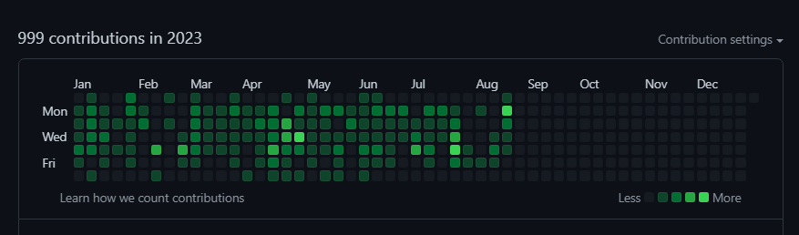

# 반갑습니다. Welcome.

  

<b>보이는게 다가 아닙니다. 그것을 자세히 바라봐야 합니다. A view is nothing. Watch that details.</b>

  

    <ul>
      <li><a href='https://kimgh06.notion.site/af98b0892fa44a62a62b222c3bae0120?pvs=74' target="_blank">나의 포트폴리오</a></li>
      <li><a href='https://introduce-of-kimgh06.netlify.app/' target="_blank">나의 명함 원본</a></li>
      <li><a href='https://velog.io/@kimgh06/posts' target="_blank">개인 블로그</a></li>
      <li><a href='https://ko.reactjs.org/docs/accessibility.html' target="_blank">React 공식 문서 보러가기</a></li>
      <ul>
          <li><a href='https://threejs-journey.com/lessons/what-are-react-and-react-three-fiber#' target="_blank">R3F 입문</li>
      </ul>
     </ul>
  

<h2>
Bug report
</h2>
E-mail : kkh061101@naver.com 
Discord : kimgh06 

